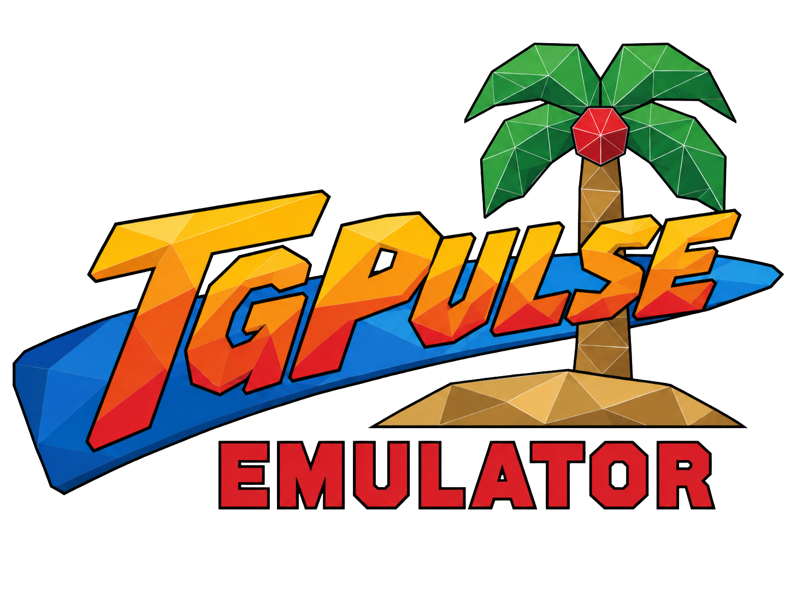

# TGPulse-Next Libretro

This is an independent repository for a future Libretro core named
`tgpulse-next-libretro`, initially targeting Sega Model 1. It is **not** a
GitHub fork of either source repository. The initial tree is a snapshot of
[TGPulse-Next](https://github.com/Zer0one/TGPulse-Next) `main` at
`3c75f9b2b155e8bb50a225c69520948ef72ecd48`, itself based on
[TGPulse](https://github.com/deepblueworks/TGPulse). The snapshot was imported
as a fresh history; the remotes `upstream-next` and `upstream-original` retain
access to both source histories.

**Bootstrap status:** no Libretro adapter or playable core has been implemented
in this repository yet. The standalone source and its documentation below are
preserved as the emulation baseline. SM2-Emu Libretro is an architectural and
workflow reference, not vendored code.

## Imported TGPulse-Next documentation

### 

This fork is maintained as [TGPulse-Next](https://github.com/Zer0one/TGPulse-Next),
based on [deepblueworks/TGPulse](https://github.com/deepblueworks/TGPulse).
The executable name remains `tgpulse`; the local development launcher remains `tgpulse.dev`.

Emulator for Sega's Model 1 and Model 2 arcade boards, written in Rust.
Currently with Linux, Windows and Android builds (Android branch).

Every processor is emulated at instruction level: the NEC V60 and MB86233 "TGP"
on the Model 1; the Intel i960, the TGP, the ADSP-21062 SHARC and the MB86235
"TGPx4" across the Model 2 revisions. No dump of the geometry engine exists, so
its display-list stream is decoded behaviourally, as MAME's is. Pixel coverage
is a hardware model in a compute shader rather than a modern rasterizer, so
dither patterns and other artefacts are reproduced.

## Running

```sh
cargo build --release
mkdir -p roms && cp ~/wherever/vf2.zip roms/
./target/release/tgpulse
```

**ROMs.** One zip per set in `roms/`, or `--roms <dir>`. Use the standard
zipped chip dumps; do not unzip them or rename their contents. Archive names
are ignored, since sets are identified by matching contents against the ROM
database. None are included here; you need the rights to the data.

**Launching.** With no arguments, the library window lists the sets found in
`roms/`, identifies them, and reports anything missing. Double-click to run;
Refresh after adding archives.

```sh
./target/release/tgpulse vf2        # by set name
./target/release/tgpulse --list     # list roms/, no window
./target/release/tgpulse --help     # all options
```

**Diagnostic panels.** Open Statistics and/or the GUI Debugger at startup:

```sh
./target/release/tgpulse wingwar --show-stats --show-debugger
```

Both flags also work without a romset, starting in the library. They apply only
to this launch and do not save panel preferences. These are the existing
View menu panels, not `--debug`, which runs the scriptable debugger without a
window. GUI panel flags cannot be combined with `--debug` or `--list`.
The existing visibility rules still apply: Statistics remains visible in
fullscreen, while the Debugger requires the interface to be visible. Add
`--fullscreen off` to inspect the Debugger if games normally start fullscreen.

**Controls.** Coin `5` (Select), start `Enter` (Start), digital movement on
arrows/WASD or the d-pad. Shared Button 1/Kick is South OR L1, Button 2/Punch
is East OR R1, and Button 3/Guard/Jump/Hold/Barrier is West. Eight cabinets
have independent game-prefixed action signals; Power Sled: Cancel Error uses North. Gun Primary/Secondary
Fire and Sky Target: Machine Gun/Missile have separate assignable signals.
Dedicated Gear Down (E/L1) and Gear Up (Q/R1) control
sequential shifting independently of Action 1/2. Analog driving uses left
stick X and R2/L2. Direct gears 1–4 use right-stick diagonals and latch when
released; West selects neutral. Gun aim uses the mouse or left stick.
Service is R3 and Test L3. The full, unfiltered signal list is editable in
Settings → Input and stored in `config/input.conf`.
See [input bindings and game routing](docs/INPUTS.md) for keyboard assignments,
combination syntax, migration and deliberate differences from SM2-Emu.

**Widescreen.** Settings → Widescreen offers Off, On and Auto. Auto follows
the saved monitor/cabinet setting for VR, Indy 500 and Sega Touring Car;
unknown games use 4:3. CLI: `--widescreen auto`. See
[native aspect detection and supported sets](docs/WIDESCREEN.md).

**Colours.** Settings → **sRGB correction** enables correct display-RGB sampling
for the game framebuffer (Model 1 and Model 2), without changing GUI colours.
It takes effect immediately and persists as `srgb = on` in
`config/settings.conf`; default `off` retains the previous presentation.
Non-sRGB output surfaces already preserve RGB bytes and need no conversion.
Separately, Model 1's 2D palette intensity bit is always emulated: bit 15 clear
halves RGB after expansion, matching MAME. This hardware correction is not
controlled by the sRGB option and does not alter Model 2 palette behaviour.

**Audio sources.** While a game is loaded, Settings → Audio shows a gain slider,
Mute checkbox and name for each output: MultiPCM 1/2 and FM (YM3438), or SCSP;
SWA/SWAJ also show DSB (MPEG). Sliders set absolute gains (50% = 0.5), with a
full-height dark-blue reference marker: MultiPCM 50%, FM 30%, DSB/SCSP 100%.
The channel slider's grab is 50% opaque and drawn above the reference marker.
Channel range 0–100%; double-click a channel slider to restore its default.
Master volume remains separate (0–800%), with the same marker style and a
100% reference restored by double-click. Gains and mutes persist in `config/settings.conf`.
Mute keeps the selected gain; chip/CPU/timer emulation continues even at zero.
YM3438 synthesis always runs: FM sounds in Virtua Racing have also been
confirmed in-game by the user. Muting FM silences only its output.
See [audio integration and limits](docs/MODEL1_AUDIO.md).

**Model 1 networking (experimental).** `cabinet = twin` fits the network board
and enables TCP for supported games. Settings exposes `AddressIn`, `PortIn`,
`AddressOut` and `PortOut`, following Supermodel Standalone's naming with MAME's
local bind address. Apply saves the configuration; reload/reset the game to use
it. TCP uses MAME's M1COMM ring frames, with no automatic loopback. Transport,
board and VR/Wing War boot/link tests pass; synchronized gameplay is not yet
validated. Wing War R360 boots, but its link test currently fails after the game
reinitializes the supplied EEPROM configuration. See
[setup, verification boundaries and remaining work](docs/MODEL1_NETWORK.md).

**Player 2 (Model 1 and Model 2).** Settings → Input has Cabinet P1/P2 tabs with
independent bindings and controller selection. P2 supports local two-player
joystick games, Model 2 guns, Dynamite Baseball's bat, Power Sled's second seat
and SWA/SWAJ's Gunner (stick and two fire buttons, no Start/view/throttle).
Signals without a P2 counterpart remain grey. P2 uses P1 gamepad conventions, with no default gameplay keys;
Coin/Start and shared Test/Service retain keyboard defaults. See
[player assignment and migration](docs/INPUTS.md#player-2--model-1-and-model-2).

| Key | |
| --- | --- |
| `F1` | show or hide the interface over a running game |
| `F3` | reset the machine |
| `F5` / `F7` | save and load the current state slot |
| `F4` / `F6` | previous and next slot |
| `F9` | pause |
| `F11` | fullscreen |
| `Tab` | fast forward while held |

**Model 1 save states.** Use Machine → Save/Load state or `F5`/`F7`, with
slots 0–9 selected by `F4`/`F6`. States use `states/<set>.<slot>.state`
in the emulator's runtime directory, like Model 2. A versioned, ROM-identified
snapshot restores the standalone machine, including in-memory NVRAM/EEPROM,
without immediately writing persistent NVRAM. Current audio/video preferences
and pause mode remain unchanged. Success/errors appear briefly even in fullscreen.
Model 1 save/load requires `cabinet = single`; a fitted COMM board is refused
even before a peer connects. This does not snapshot a network session.
The desktop integration has automated coverage and the user confirms basic
save/load working in VR and SWA; other games and broader scenarios remain to validate.
F4/F6 display the selected slot briefly, including in fullscreen.
See the [checkpoint evidence](docs/MODEL1_ROADMAP.md#desktop-saveload-checkpoint--2026-09-27).

**Files written.** Battery-backed RAM (high scores, rankings, test menu
settings) to `nvram/<set>.nv` on close, reloaded on the next run. Save states to
`states/`, options and bindings to `config/`. Nothing is written elsewhere.

## Rendering

Native output is 496x384 with no antialiasing. The rasterizer is reproduced
exactly, including dither patterns, stipple transparency and painter-sort
artefacts.

- `--ssaa 1..4` (default 2) supersamples the 3D layer and presents it at twice
  board resolution; tile layers (HUD, text, sky) scale by integer factors.
  `--ssaa 1` is the board's output pixel for pixel.
- `--widescreen on` renders 16:9 by widening the frustum and viewport around
  the centre rather than stretching. Not hardware behaviour: games composed for
  4:3 may show edge-pinned HUD elements and scenery ending where the original
  camera stopped. 2D layers stretch to fill unless `--widescreen-stretch-2d
  off`.
- `--smooth-shadows off` reproduces the board's lack of an alpha channel:
  checkerboard-stipple shadows and thresholded per-texel coverage on
  translucent textures. The default blends them.

## Status

The ROM database covers 100 sets, but an entry only means the memory image can
be built, not that the game runs. Twelve are tested: they boot, play, and
render frames checked against MAME. The rest may do anything from black-screen
to subtly wrong.

| Board | Tested |
| --- | --- |
| Model 1 | Virtua Racing, Virtua Fighter, Star Wars Arcade |
| Model 2 | Daytona USA (and Special Edition), Virtua Cop |
| Model 2A | Sega Rally Championship, Virtua Fighter 2 |
| Model 2B | Virtua Striker, Sonic Championship |
| Model 2C | The House of the Dead, Wave Runner |

**No multiplayer.** M2COMM is modelled only as far as one cabinet needs: the
ring closes on itself so the network check passes. Twin Daytona and Virtua
Striker's versus play run as a single machine.

## Roadmap

For this fork's source-audited Model 1 gaps, ROM baseline and bounded fixes, see
[Model 1 roadmap](docs/MODEL1_ROADMAP.md).

- **More games.** New sets tend to expose real bugs: Virtua Fighter 2's hair was an i960 burst-read bug, Wave Runner's failure to boot a missing EEPROM.
- **Performance improvements.**  Could be achieved by moving the coprocessors to their own threads and a JIT/dynarec. Currently it can be slow on low powered devices.
- **Multiplayer.** Link two instances over a socket, as MAME's `m2comm` does.
- **Model 1 save-state acceptance.** Core and desktop integration are implemented for standalone machines; broader in-game/manual frontend validation remains.
- **Encrypted sets.** The 315-5881 implementation is in the tree but unused, so Dynamite Cop, Zero Gunner and the rest do not run.
- **`model1io2`.** Not emulated, so Wing War and Sega NetMerc are left out of the database's I/O firmware wiring.

## Layout

```
crates/i960        Intel i960KB              -- Model 2 main CPU
crates/v60         NEC V60                   -- Model 1 main CPU
crates/mb86233     Fujitsu MB86233 "TGP"     -- Model 1 and 2/2A geometry
crates/mb86235     Fujitsu MB86235 "TGPx4"   -- Model 2C geometry
crates/sharc       Analog Devices ADSP-21062 -- Model 2B geometry
crates/sega-crypt  Sega 315-5881 decryption
crates/tgpulse-core  the machine: memory maps, geometry, sound, save states
crates/tgpulse       the front end: window, renderer, interface, input, audio
tools/               the ROM database generator and a MAME comparison harness
```

`tgpulse-core` has no window, GPU or controller: a front end drives it a frame
at a time and reads back the framebuffer, so the debugger and the comparison
harness can run it headlessly.

## Accuracy

MAME is the reference. Memory maps follow its ordering so the two can be read
side by side, and divergences are found by diffing instruction traces, work RAM
and rendered frames (`tools/mamediff.sh`).

The debugger is script-driven and the machine deterministic, so investigations
replay exactly:

```sh
./target/release/tgpulse vf2 --debug -c "run 1400; geo; vertices"
```

Output is one `kind key=value` line at a time, and every command reports what
it did.

## Building

A Cargo workspace with no vendored dependencies. A stable toolchain from
[rustup](https://rustup.rs) is enough; the binary lands in
`target/release/tgpulse`.

**Linux.**

```sh
sudo apt install build-essential libudev-dev libasound2-dev   # Debian, Ubuntu
sudo pacman -S base-devel systemd-libs alsa-lib               # Arch
sudo dnf install gcc systemd-devel alsa-lib-devel             # Fedora

cargo build --release
```

`libudev` is for gamepad detection, ALSA for audio. Rendering uses Vulkan where
the driver offers it and GL otherwise.

**Windows.** Native builds need the MSVC toolchain and Visual Studio's C++
build tools, then `cargo build --release`. Cross-compiling from Linux needs
only the target and mingw, the linker already being named in
`.cargo/config.toml`:

```sh
rustup target add x86_64-pc-windows-gnu
sudo apt install mingw-w64          # or: pacman -S mingw-w64-gcc
cargo build --release --target x86_64-pc-windows-gnu
```

The result is `target/x86_64-pc-windows-gnu/release/tgpulse.exe`, which wants
the same `roms/` directory beside it.

**Tests.** `cargo test --release`. The processor tests assemble their own
programs and need no ROM data.

Android is packaged with `cargo-apk` and covered in
[docs/BUILDING.md](docs/BUILDING.md); it has not been run on a device.

## Thanks

**The MAME project** — public documentation of these boards, down to chip
identification, bus wiring and undocumented registers, is what makes an
independent implementation practical, and is the reference used here.

**ElSemi** — Nebula Model 2 established much of the current understanding of
the geometry pipeline and rasterizer, and widescreen mode follows it.

Neither is affiliated with this project. Any inaccuracy is this program's own.

## License

MIT, in [LICENSE](LICENSE). ROM images are copyrighted by their publishers and
none are included here.

The YM3438 register/timer and synthesis adaptation retains Aaron Giles' YMFM
[BSD-3-Clause notice](LICENSES/YMFM-BSD-3-Clause.txt). Its current scope and
reference checks are documented in [Model 1 audio](docs/MODEL1_AUDIO.md).

## Logging

Off by default, addressable per subsystem:

```sh
RUST_LOG=info ./target/release/tgpulse vf2
RUST_LOG=warn,geo=trace ./target/release/tgpulse vf2
```

Targets include `geo`, `fifo`, `io`, `sound`, `copro`, `nvram`, `backup`,
`comm`, `library` and `video`.
